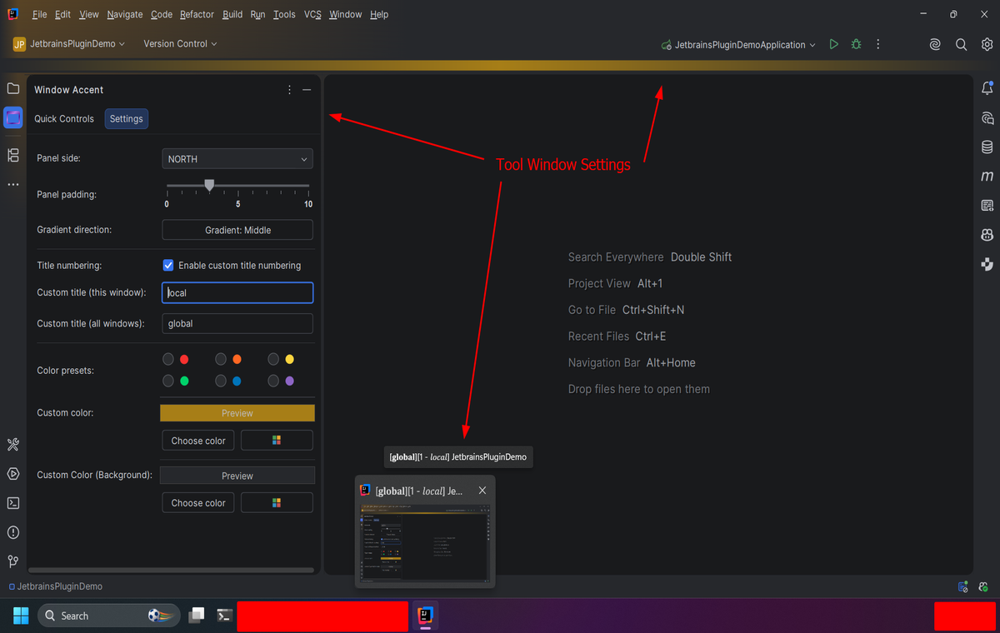

# Window Accent

> Distinguish between multiple JetBrains IDE windows with visual cues

---

## Welcome

Window Accent helps you instantly recognize which project you're working on by adding subtle, customizable accent
colors to IntelliJ-based IDEs.

[Install from Marketplace](https://plugins.jetbrains.com/plugin/31895-window-accent){ .md-button .md-button--primary }

[View Source](https://github.com/alexBlakeGoudemond/jetbrains-window-accent){ .md-button }

[Report Issue / Feature Request](https://github.com/alexBlakeGoudemond/jetbrains-window-accent/issues){ .md-button }

---

## Why Window Accent?

-   :material-palette:

    **Custom Accent Colors**

    Choose colors, add window titles that help distinguish projects and environments.

-   :material-lightning-bolt:

    **Lightweight**

    Designed to feel like a native IntelliJ feature.

-   :material-github:

    **Open Source**

    MIT licensed and developed in the open.

-   :material-update:

    **Marketplace Updates**

    Receive updates through the JetBrains Marketplace.

---

## See it in Action

---

## Open Source

Window Accent is released under the MIT License.

Bug reports, feature requests and pull requests are always welcome.

⭐ If you find Window Accent useful, consider starring the project on GitHub or leaving a review on the
JetBrains Marketplace.

---
